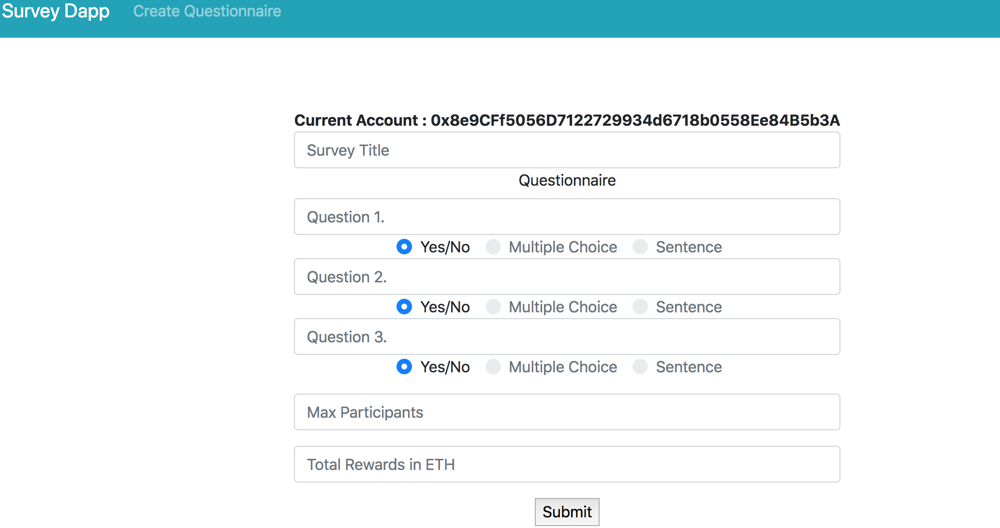
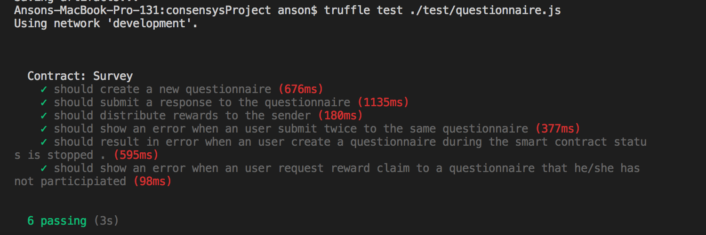

# Background
### This is a survey smart contract, anyone can create a questionnaire and reward to the participants by Ether.
#### (Only allow YES/NO question at this stage)

 

### Running the Dapp locally

NodeJS Version: v8.7

**If you want to get some ETH in testnet, go to https://faucet.rinkeby.io/**

The smart contract has been deployed to the Rinkeby testnet. Please do the following steps to start the app & interact with the smart contract.

* Download the project, `git clone https://github.com/ansonla3/consensysProject`
* `cd consensysProject`
* Install all the packages, `npm install`
* Start the app, `npm run dev`
* When the app is ready, go to http://localhost:3000

### Running the Tests

Make sure install the ganache-cli. If not, run `npm install -g ganache-cli`

* To start the ganache, `ganache-cli`
* Go to the consensys project, `cd consensyProject`
* Compile contracts, `truffle compile`
* Migrate contracts, `truffle migrate`
* Execute all tests, `truffle test ./test/questionnaire.js`

 

### Questions
Please free feel to open an issue in this repo if you have any questions.
